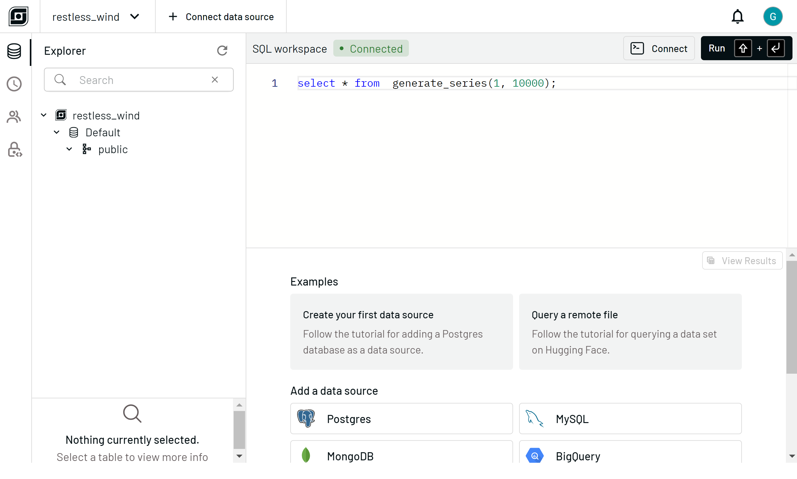

# GlareDB Node.js Bindings Example

GlareDB is a fast SQL database for running analytics across distributed data.

This repository contains examples of using GlareDB Node.js bindings to
analyze local files and join them with remote data in [GlareDB Cloud].

You can use these bindings with JavaScript and TypeScript.

## Requirements

- Node.js 20.10.0+ (LTS) <https://nodejs.org/en>

## Usage

After cloning or downloading the repository, install dependencies:

```shell
npm install
```

Then, you can run the example:

```shell
npm run start
```

The example code queries a CSV file: `src/students.csv`. The code is located in
`src/main.ts`.

### GlareDB Cloud

`src/cloud.ts` contains a code example for joining data in your GlareDB Cloud
with local data in `customer_report.csv`. To run this example:

1. Sign up for [GlareDB Cloud]. After signing in, you'll be dropped into the
   SQL Workspace, where you can explore and query your GlareDB data in the
   browser.

   

2. Click **Create your first data source**, which adds a query to the editor for
   adding a demo Postgres database.

   

3. Click **Run** to run the query. The **Explorer** on the left will now contain
   the Postgres database, called `my_pg`. You can explore the database. To
   ensure you're viewing the freshest schema, click the refresh icon at the top
   of the explorer.

   

   Tables have a 3-dot context menu. For example, click the 3-dot menu for the
   `customer` table, and then click **SELECT query**, which adds a query to
   select that table in the editor.

   

4. Click the **Connect** button (next to Run) to open the **Connection modal**.
   Navigate to the **Node.js** tab and copy the **Connection String**. If you're
   a returning user and didn't store your password, click new password to create
   a new user/password pair. Passwords are displayed only once.

   

5. In `src/cloud.ts`, copy the **Connection String** into the variable
   `cloudURL`.

6. Run the code!

   ```shell
   npm run start:cloud
   ```

   Taking a closer look at `src/cloud.ts`, the query is performing
   a `JOIN` on the Postgres data in GlareDB Cloud (`my_pg`) with a local CSV
   file `customer_report.csv`. This is the essence of GlareDB: query and access
   all of your data, easily.

### Further Reading

- In addition to these NodeJS bindings, GlareDB has [Python bindings]
- You can also run GlareDB as an interactive [CLI]
- Connecting to [GlareDB Cloud] utilizes [Hybrid Execution]: queries are
  computed using both local and remote compute resources for optimal efficiency.

[GlareDB Cloud]: https://console.glaredb.com
[Python bindings]: https://pypi.org/project/glaredb/
[CLI]: https://github.com/GlareDB/glaredb?tab=readme-ov-file#getting-started
[Hybrid Execution]: https://docs.glaredb.com/glaredb/hybrid-execution/
